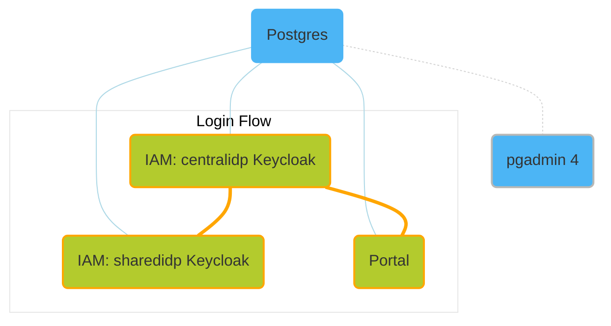

# Setup of CX Portal & IAM for local development

 

This umbrella chart installs the helm charts of the [CX Portal](https://github.com/eclipse-tractusx/portal-cd/blob/portal-2.0.0/charts/portal/README.md) and of the [CX IAM](https://github.com/eclipse-tractusx/portal-iam) Keycloak instances ([centralidp](https://github.com/eclipse-tractusx/portal-iam/blob/centralidp-3.0.0/charts/centralidp/README.md) and [sharedidp](https://github.com/eclipse-tractusx/portal-iam/blob/sharedidp-3.0.0/charts/sharedidp/README.md)).

It's intended for the local setup of the those components in order to aid the local development. To integrate your local development, adapt the address values in the Values file for [Portal Frontend](./values.yaml#L23) and/or [Portal Backend](./values.yaml#L27).

This chart also sets up an additional [postgresql](https://artifacthub.io/packages/helm/bitnami/postgresql) instance to support the Portal Backend development as well as a [pgadmin4](https://artifacthub.io/packages/helm/runix/pgadmin4) instance for easy access to the deployed Postgres databases which are only available from within the Kubernetes cluster.

For detailed information about the default configuration values, please have a look at the [Values table](#values) and/or [Values file](./values.yaml).

- [Usage](#usage)
- [Cluster setup](#cluster-setup)
- [Prepare network setup](#prepare-network-setup)
- [Install](#install)
  - [Use released chart](#use-released-chart)
  - [Use local repository](#use-local-repository)
- [Perform first login](#perform-first-login)
- [Database Access](#database-access)
- [Keycloak Admin Console](#keycloak-admin-console)
- [Uninstall](#uninstall)
- [Prepare self-signed TLS setup (Optional)](#1-prepare-self-signed-tls-setup-optional)

## Usage

The following steps describe how to setup the umbrella chart into the namespace 'umbrella' of your started [**Minikube**](https://minikube.sigs.k8s.io/docs/start) cluster.

> **Note**
>
> In its current state of development, this chart as well as the following installation guide have been tested on Linux and Mac.
>
> **Linux** is the **preferred platform** to install this chart on as the network setup with Minikube is very straightforward on Linux.
>
> We are working on testing the chart's reliability on Windows as well and updating the installation guide accordingly.

> **Recommendations**
>
> Resources for Minikube
> | CPU(cores) | Memory(GB) |
> | :--------: | :--------: |
> |     4      |      6     |

> Use the dashboard provided by Minikube to get an overview about the deployed components:
>
> ```bash
> minikube dashboard
> ```

## Cluster Setup

### Linux & Mac

```bash
minikube start --cpus=4 --memory 6gb
```

### Windows

For DNS resolution to work you need to either use `--driver=hyperv` option which requires administrator privileges:

```bash
minikube start --cpus=4 --memory 6gb --driver=hyperv
```

or use the native Kubernetes Cluster in *Docker Desktop* as well with a manual ingress setup:

```bash
# 1. Enable Kubernetes under Settings > Kubernetes > Enable Kubernetes
# 2. Install an NGINX Ingress Controller
helm upgrade --install ingress-nginx ingress-nginx --repo https://kubernetes.github.io/ingress-nginx --namespace ingress-nginx --create-namespace
# 3. Skip the minikube addons and assume 127.0.0.1 for Cluster IP
```

> :warning: The rest of the tutorial assumes a minikube cluster, however.

## Prepare network setup

In order to enable the local access via **ingress**, use the according addon for Minikube:

```bash
minikube addons enable ingress
```

Make sure that the **DNS** resolution for the hostnames is in place:

```bash
minikube addons enable ingress-dns
```
And execute installation step [3 Add the `minikube ip` as a DNS server](https://minikube.sigs.k8s.io/docs/handbook/addons/ingress-dns) for your OS:

```
domain tx.test
nameserver 192.168.49.2
search_order 1
timeout 5
```
Replace 192.168.49.2 with your minikube ip.

To find out the IP address of your Minikube:

```bash
minikube ip
```

If while [performing the first login](#perform-first-login) your still facing DNS issues, add the following to your /etc/hosts file:

```
192.168.49.2    centralidp.tx.test
192.168.49.2    sharedidp.tx.test
192.168.49.2    portal.tx.test
192.168.49.2    portal-backend.tx.test
192.168.49.2    pgadmin4.tx.test
```

Replace 192.168.49.2 with your minikube ip.

**Additional network setup** (for Mac only)

Install and start [Docker Mac Net Connect](https://github.com/chipmk/docker-mac-net-connect#installation).

We also recommend to execute the usage example after install to check proper setup.

If you're having issues with getting 'Docker Mac Net Connect' to work, we recommend to check out this issue: [#21](https://github.com/chipmk/docker-mac-net-connect/issues/21).

The tool is necessary due to [#7332](https://github.com/kubernetes/minikube/issues/7332).

## Install

### Use released chart

Install the chart with the release name 'local':

```bash
helm repo add tractusx-dev https://eclipse-tractusx.github.io/charts/dev
```

```bash
helm install local tractusx-dev/localdev-portal-iam --namespace umbrella --create-namespace
```

To set your own configuration and secret values, install the helm chart with your own values file:

```bash
helm install -f your-values.yaml local tractusx-dev/localdev-portal-iam --namespace umbrella --create-namespace
```

#### Use local repository

Make sure to clone the [portal](https://github.com/eclipse-tractusx/portal) repository beforehand.

Then change to the chart directory:

```bash
cd charts/localdev/
```
Download the chart dependencies:

```bash
helm dependency update
```

Install the chart with the release name 'local':

```bash
helm install local . --namespace umbrella --create-namespace
```

To set your own configuration and secret values, install the helm chart with your own values file:

```bash
helm install local -f your-values.yaml . --namespace umbrella --create-namespace
```

> :warning: **Note**
>
> It is to be expected that some pods - which run as post-install hooks, like for instance the **portal-migrations job - will run into errors until another component**, like for instance a database, is ready to take connections.
> Those jobs will recreate pods until one run is successful.

## Perform first login

Make sure to accept the risk of the self-signed certificates for the following hosts using the continue option:
- [centralidp.tx.test/auth/](http://centralidp.tx.test/auth/)
- [sharedidp.tx.test/auth/](http://sharedidp.tx.test/auth/)
- [portal-backend.tx.test](http://portal-backend.tx.test)
- [portal.tx.test](http://portal.tx.test)

Then proceed with the login to the [portal](http://portal.tx.test) to verify that everything is setup as expected.

Credentials to log into the initial example realm (CX-Operator):

```
cx-operator@tx.test
```

```
tractusx-umbr3lla!
```



## Database Access

This chart also contains a pgadmin4 instance for easy access to the deployed Postgres databases which are only available from within the Kubernetes cluster.

pgadmin4 is by default enabled with in the predefined subsets for data exchange and portal.

Address: [pgadmin4.tx.test](http://pgadmin4.tx.test)

Credentials to login into pgadmin4:

```
pgadmin4@txtest.org
```

```
tractusxpgdamin4
```

**The database server connections need to be added manually to pgadmin4.**

Default username for all connections:

```
postgres
```

Default port for all connections:

```
5432
```

In the following some of the available connections:

- portal db

Host:

```
local-portal-backend-postgresql
```

Password:

```
dbpasswordportal
```

- centralidp db

Host:

```
local-centralidp-postgresql
```

Password:

```
dbpasswordcentralidp
```

- sharedidp db

Host:

```
local-sharedidp-postgresql
```

Password:

```
dbpasswordsharedidp
```

- additional portal db

Host:

```
local-portal-postgresql
```

Password:

```
dbpasswordadditional
```

## Keycloak Admin Console

Access to admin consoles:

- http://centralidp.tx.test/auth/
- http://sharedidp.tx.test/auth/

Default username for centralidp and sharedidp:

```
admin
```

Password centralidp:

```
adminconsolepwcentralidp
```

Password sharedidp:

```
adminconsolepwsharedidp
```

## Uninstall

To teardown your setup, run:

```shell
helm delete local --namespace umbrella
```

> :warning:
>
> If persistance for one or more components is enabled, the persistent volume claims (PVCs) and connected persistent volumes (PVs) need to be removed manually even if you deleted the release from the cluster.
>

## Prepare self-signed TLS setup (Optional)

The components are prepared to be configured with TLS enabled (see "uncomment the following line for tls" comments in [values.yaml](./values.yaml)).

If you'd like to make use of that, make sure to to execute this step beforehand.

Install cert-manager chart in the same namespace where the localdev chart will be located.

```bash
helm repo add jetstack https://charts.jetstack.io
helm repo update
```
```bash
helm install \
  cert-manager jetstack/cert-manager \
  --namespace umbrella \
  --create-namespace \
  --version v1.13.0 \
  --set installCRDs=true
```

```bash
kubectl apply -f - <<EOF
apiVersion: cert-manager.io/v1
kind: ClusterIssuer
metadata:
  name: selfsigned-issuer
spec:
  selfSigned: {}
---
apiVersion: cert-manager.io/v1
kind: Certificate
metadata:
  name: my-selfsigned-ca
  namespace: umbrella
spec:
  isCA: true
  commonName: cx.local
  secretName: root-secret
  privateKey:
    algorithm: RSA
    size: 2048
  issuerRef:
    name: selfsigned-issuer
    kind: ClusterIssuer
    group: cert-manager.io
  subject:
    organizations:
      - CX
    countries:
      - DE
    provinces:
      - Some-State
---
apiVersion: cert-manager.io/v1
kind: ClusterIssuer
metadata:
  name: my-ca-issuer
spec:
  ca:
    secretName: root-secret
EOF
```
See [cert-manager self-signed](https://cert-manager.io/docs/configuration/selfsigned) for reference.

## Requirements

| Repository | Name | Version |
|------------|------|---------|
| https://charts.bitnami.com/bitnami | postgresportal(postgresql) | 12.12.x |
| https://eclipse-tractusx.github.io/charts/dev | centralidp | 3.0.0 |
| https://eclipse-tractusx.github.io/charts/dev | portal | 2.0.0 |
| https://eclipse-tractusx.github.io/charts/dev | sharedidp | 3.0.0 |
| https://helm.runix.net | pgadmin4 | 1.17.x |

## Values

| Key | Type | Default | Description |
|-----|------|---------|-------------|
| portal.enabled | bool | `true` |  |
| portal.portalAddress | string | `"http://portal.tx.test"` | Set your local frontend to integrate into local development. |
| portal.portalBackendAddress | string | `"http://portal-backend.tx.test"` | Set your local backend service to integrate into local development. Start port forwarding tunnel for database access, e.g.: 'kubectl port-forward service/local-portal-backend-postgresql 5432:5432 -n umbrella' |
| portal.centralidp.address | string | `"http://centralidp.tx.test"` |  |
| portal.sharedidpAddress | string | `"http://sharedidp.tx.test"` |  |
| portal.semanticsAddress | string | `"http://semantics.tx.test"` |  |
| portal.bpdm.poolAddress | string | `"http://business-partners.tx.test"` |  |
| portal.bpdm.portalGateAddress | string | `"http://business-partners.tx.test"` |  |
| portal.custodianAddress | string | `"http://managed-identity-wallets.tx.test"` |  |
| portal.sdfactoryAddress | string | `"http://sdfactory.tx.test"` |  |
| portal.clearinghouseAddress | string | `"http://validation.tx.test"` |  |
| portal.clearinghouseTokenAddress | string | `"http://keycloak.tx.test/realms/example/protocol/openid-connect/token"` |  |
| portal.issuerComponentAddress | string | `"http://ssi-credential-issuer.tx.test"` |  |
| portal.bpnDidResolver.managementApiAddress | string | `"http://bpn-did-resolution-service-bdrs-server:8081"` |  |
| portal.bpnDidResolver.directoryApiAddress | string | `"http://bpn-did-resolution-service.tx.test/api/directory"` |  |
| portal.dimWrapper.baseAddress | string | `"http://dim-wrapper.tx.test"` |  |
| portal.decentralIdentityManagementAuthAddress | string | `"http://dim.tx.test"` |  |
| portal.replicaCount | int | `1` |  |
| portal.readinessProbes.initialDelaySeconds | int | `200` |  |
| portal.frontend.portal.requireHttpsUrlPattern | bool | `false` |  |
| portal.frontend.ingress.enabled | bool | `true` |  |
| portal.frontend.ingress.annotations."nginx.ingress.kubernetes.io/rewrite-target" | string | `"/$1"` |  |
| portal.frontend.ingress.annotations."nginx.ingress.kubernetes.io/use-regex" | string | `"true"` |  |
| portal.frontend.ingress.annotations."nginx.ingress.kubernetes.io/enable-cors" | string | `"true"` |  |
| portal.frontend.ingress.annotations."nginx.ingress.kubernetes.io/cors-allow-origin" | string | `"http://*.tx.test"` |  |
| portal.frontend.ingress.hosts[0].host | string | `"portal.tx.test"` |  |
| portal.frontend.ingress.hosts[0].paths[0].path | string | `"/(.*)"` |  |
| portal.frontend.ingress.hosts[0].paths[0].pathType | string | `"ImplementationSpecific"` |  |
| portal.frontend.ingress.hosts[0].paths[0].backend.service | string | `"portal"` |  |
| portal.frontend.ingress.hosts[0].paths[0].backend.port | int | `8080` |  |
| portal.frontend.ingress.hosts[0].paths[1].path | string | `"/registration/(.*)"` |  |
| portal.frontend.ingress.hosts[0].paths[1].pathType | string | `"ImplementationSpecific"` |  |
| portal.frontend.ingress.hosts[0].paths[1].backend.service | string | `"registration"` |  |
| portal.frontend.ingress.hosts[0].paths[1].backend.port | int | `8080` |  |
| portal.frontend.ingress.hosts[0].paths[2].path | string | `"/((assets|documentation)/.*)"` |  |
| portal.frontend.ingress.hosts[0].paths[2].pathType | string | `"ImplementationSpecific"` |  |
| portal.frontend.ingress.hosts[0].paths[2].backend.service | string | `"assets"` |  |
| portal.frontend.ingress.hosts[0].paths[2].backend.port | int | `8080` |  |
| portal.backend.dotnetEnvironment | string | `"Development"` |  |
| portal.backend.useDimWallet | bool | `false` |  |
| portal.backend.keycloak.central.clientId | string | `"sa-cl1-reg-2"` |  |
| portal.backend.keycloak.central.clientSecret | string | `"aEoUADDw2aNPa0WAaKGAyKfC80n8sKxJ"` |  |
| portal.backend.keycloak.central.jwtBearerOptions.requireHttpsMetadata | string | `"false"` |  |
| portal.backend.keycloak.shared.clientId | string | `"sa-cl1-reg-1"` |  |
| portal.backend.keycloak.shared.clientSecret | string | `"YPA1t6BMQtPtaG3fpH8Sa8Ac6KYbPUM7"` |  |
| portal.backend.registration.logging.default | string | `"Debug"` |  |
| portal.backend.registration.logging.bpdmLibrary | string | `"Debug"` |  |
| portal.backend.registration.logging.registrationService | string | `"Debug"` |  |
| portal.backend.registration.swaggerEnabled | bool | `true` |  |
| portal.backend.administration.logging.default | string | `"Debug"` |  |
| portal.backend.administration.logging.businessLogic | string | `"Debug"` |  |
| portal.backend.administration.logging.sdfactoryLibrary | string | `"Debug"` |  |
| portal.backend.administration.logging.bpdmLibrary | string | `"Debug"` |  |
| portal.backend.administration.logging.custodianLibrary | string | `"Debug"` |  |
| portal.backend.administration.issuerdid | string | `"did:web:tx.test:test123"` |  |
| portal.backend.administration.swaggerEnabled | bool | `true` |  |
| portal.backend.appmarketplace.logging.default | string | `"Debug"` |  |
| portal.backend.appmarketplace.logging.offersLibrary | string | `"Debug"` |  |
| portal.backend.appmarketplace.swaggerEnabled | bool | `true` |  |
| portal.backend.appmarketplace.resources.limits.memory | string | `"600M"` |  |
| portal.backend.services.logging.default | string | `"Debug"` |  |
| portal.backend.services.logging.offersLibrary | string | `"Debug"` |  |
| portal.backend.services.swaggerEnabled | bool | `true` |  |
| portal.backend.notification.logging.default | string | `"Debug"` |  |
| portal.backend.notification.swaggerEnabled | bool | `true` |  |
| portal.backend.processesworker.logging.default | string | `"Debug"` |  |
| portal.backend.processesworker.logging.processesLibrary | string | `"Debug"` |  |
| portal.backend.processesworker.logging.bpdmLibrary | string | `"Debug"` |  |
| portal.backend.processesworker.logging.clearinghouseLibrary | string | `"Debug"` |  |
| portal.backend.processesworker.logging.custodianLibrary | string | `"Debug"` |  |
| portal.backend.processesworker.logging.sdfactoryLibrary | string | `"Debug"` |  |
| portal.backend.processesworker.logging.offerProvider | string | `"Debug"` |  |
| portal.backend.processesworker.bpdm.clientId | string | `"sa-cl7-cx-5"` |  |
| portal.backend.processesworker.bpdm.clientSecret | string | `"bWSck103qNJ0jZ1LVtG9mUAlcL7R5RLg"` |  |
| portal.backend.processesworker.custodian | object | `{"clientId":"sa-cl5-custodian-2","clientSecret":"UIqawwoohsvZ6AZOd1llLhnsUTKMWe4D"}` | no configuration for clearinghouse because it's an external component clientId and clientSecret aren't in the centralidp Keycloak clearinghouse:   clientId: "clearinghouse-client-id"   clientSecret: "" |
| portal.backend.processesworker.sdfactory.issuerBpn | string | `"BPNL00000003CRHK"` |  |
| portal.backend.processesworker.sdfactory.clientId | string | `"sa-cl8-cx-1"` |  |
| portal.backend.processesworker.sdfactory.clientSecret | string | `"clbQOPHcVKY9tUUd068vyf8CrsPZ8BgZ"` |  |
| portal.backend.processesworker.offerprovider.clientId | string | `"sa-cl2-03"` |  |
| portal.backend.processesworker.offerprovider.clientSecret | string | `"wyNYzSnyu4iGvj17XgLSl0aQxAPjTjmI"` |  |
| portal.backend.processesworker.dim.clientId | string | `"dim-client-id"` |  |
| portal.backend.processesworker.dim.clientSecret | string | `""` |  |
| portal.backend.processesworker.dim.universalResolverAddress | string | `"https://dev.uniresolver.io/"` |  |
| portal.backend.processesworker.issuerComponent.clientId | string | `"sa-cl2-04"` |  |
| portal.backend.processesworker.issuerComponent.clientSecret | string | `"c0gFPfWWUpeOr7MP6DIqdRPhUfaX4GRC"` |  |
| portal.backend.processesworker.bpnDidResolver.apiKey | string | `""` | ApiKey for management endpoint of the bpnDidResolver. Secret-key 'bpndidresolver-api-key'. |
| portal.backend.mailing.host | string | `"smtp.tx.test"` |  |
| portal.backend.mailing.port | string | `"587"` |  |
| portal.backend.mailing.user | string | `"smtp-user"` |  |
| portal.backend.mailing.senderEmail | string | `"smtp@tx.test"` |  |
| portal.backend.mailing.password | string | `""` |  |
| portal.backend.portalmigrations.logging.default | string | `"Debug"` |  |
| portal.backend.portalmigrations.resources.limits.cpu | string | `"200m"` |  |
| portal.backend.provisioningmigrations.logging.default | string | `"Debug"` |  |
| portal.backend.provisioningmigrations.resources.limits.cpu | string | `"150m"` |  |
| portal.backend.provisioning.sharedRealm.smtpServer.host | string | `"smtp.tx.test"` |  |
| portal.backend.provisioning.sharedRealm.smtpServer.port | string | `"587"` |  |
| portal.backend.provisioning.sharedRealm.smtpServer.user | string | `"smtp-user"` |  |
| portal.backend.provisioning.sharedRealm.smtpServer.password | string | `""` |  |
| portal.backend.provisioning.sharedRealm.smtpServer.from | string | `"smtp@tx.test"` |  |
| portal.backend.provisioning.sharedRealm.smtpServer.replyTo | string | `"smtp@tx.test"` |  |
| portal.backend.ingress | object | `{"annotations":{"nginx.ingress.kubernetes.io/cors-allow-origin":"http://localhost:3000, http://*.tx.test","nginx.ingress.kubernetes.io/enable-cors":"true","nginx.ingress.kubernetes.io/proxy-body-size":"8m","nginx.ingress.kubernetes.io/use-regex":"true"},"enabled":true,"hosts":[{"host":"portal-backend.tx.test","paths":[{"backend":{"port":8080,"service":"registration-service"},"path":"/api/registration","pathType":"Prefix"},{"backend":{"port":8080,"service":"administration-service"},"path":"/api/administration","pathType":"Prefix"},{"backend":{"port":8080,"service":"notification-service"},"path":"/api/notification","pathType":"Prefix"},{"backend":{"port":8080,"service":"provisioning-service"},"path":"/api/provisioning","pathType":"Prefix"},{"backend":{"port":8080,"service":"marketplace-app-service"},"path":"/api/apps","pathType":"Prefix"},{"backend":{"port":8080,"service":"services-service"},"path":"/api/services","pathType":"Prefix"}]}],"name":"portal-backend"}` | docs: http://portal-backend.tx.test/api/administration/swagger/index.html http://portal-backend.tx.test/api/registration/swagger/index.html http://portal-backend.tx.test/api/apps/swagger/index.html http://portal-backend.tx.test/api/services/swagger/index.html http://portal-backend.tx.test/api/notification/swagger/index.html |
| portal.postgresql.nameOverride | string | `"portal-backend-postgresql"` |  |
| portal.postgresql.architecture | string | `"standalone"` |  |
| portal.postgresql.auth.password | string | `"dbpasswordportal"` |  |
| portal.postgresql.auth.portalPassword | string | `"dbpasswordportal"` |  |
| portal.postgresql.auth.provisioningPassword | string | `"dbpasswordportal"` |  |
| centralidp.enabled | bool | `true` |  |
| centralidp.keycloak.nameOverride | string | `"centralidp"` |  |
| centralidp.keycloak.replicaCount | int | `1` |  |
| centralidp.keycloak.postgresql.nameOverride | string | `"centralidp-postgresql"` |  |
| centralidp.keycloak.postgresql.architecture | string | `"standalone"` |  |
| centralidp.keycloak.proxy | string | `"edge"` |  |
| centralidp.keycloak.initContainers[0].name | string | `"realm-import"` |  |
| centralidp.keycloak.initContainers[0].image | string | `"docker.io/tractusx/umbrella-init-container:0.1.0-init"` |  |
| centralidp.keycloak.initContainers[0].imagePullPolicy | string | `"IfNotPresent"` |  |
| centralidp.keycloak.initContainers[0].command[0] | string | `"sh"` |  |
| centralidp.keycloak.initContainers[0].args[0] | string | `"-c"` |  |
| centralidp.keycloak.initContainers[0].args[1] | string | `"echo \"Copying realms...\"\ncp -R /import/catenax-central/R2405/realms/* /realms\n"` |  |
| centralidp.keycloak.initContainers[0].volumeMounts[0].name | string | `"realms"` |  |
| centralidp.keycloak.initContainers[0].volumeMounts[0].mountPath | string | `"/realms"` |  |
| centralidp.keycloak.initContainers[1].name | string | `"theme-import"` |  |
| centralidp.keycloak.initContainers[1].image | string | `"docker.io/tractusx/portal-iam:v3.0.0"` |  |
| centralidp.keycloak.initContainers[1].imagePullPolicy | string | `"IfNotPresent"` |  |
| centralidp.keycloak.initContainers[1].command[0] | string | `"sh"` |  |
| centralidp.keycloak.initContainers[1].args[0] | string | `"-c"` |  |
| centralidp.keycloak.initContainers[1].args[1] | string | `"echo \"Copying themes...\"\ncp -R /import/themes/catenax-central/* /themes\n"` |  |
| centralidp.keycloak.initContainers[1].volumeMounts[0].name | string | `"themes"` |  |
| centralidp.keycloak.initContainers[1].volumeMounts[0].mountPath | string | `"/themes"` |  |
| centralidp.keycloak.extraEnvVars[0].name | string | `"KEYCLOAK_EXTRA_ARGS"` |  |
| centralidp.keycloak.extraEnvVars[0].value | string | `"-Dkeycloak.migration.action=import -Dkeycloak.migration.provider=singleFile -Dkeycloak.migration.file=/realms/CX-Central-realm.json -Dkeycloak.migration.strategy=IGNORE_EXISTING"` |  |
| centralidp.keycloak.extraVolumes[0].name | string | `"realms"` |  |
| centralidp.keycloak.extraVolumes[0].emptyDir | object | `{}` |  |
| centralidp.keycloak.extraVolumes[1].name | string | `"themes"` |  |
| centralidp.keycloak.extraVolumes[1].emptyDir | object | `{}` |  |
| centralidp.keycloak.extraVolumeMounts[0].name | string | `"realms"` |  |
| centralidp.keycloak.extraVolumeMounts[0].mountPath | string | `"/realms"` |  |
| centralidp.keycloak.extraVolumeMounts[1].name | string | `"themes"` |  |
| centralidp.keycloak.extraVolumeMounts[1].mountPath | string | `"/opt/bitnami/keycloak/themes/catenax-central"` |  |
| centralidp.keycloak.ingress.enabled | bool | `true` |  |
| centralidp.keycloak.ingress.ingressClassName | string | `"nginx"` |  |
| centralidp.keycloak.ingress.hostname | string | `"centralidp.tx.test"` |  |
| centralidp.keycloak.ingress.annotations."nginx.ingress.kubernetes.io/cors-allow-credentials" | string | `"true"` |  |
| centralidp.keycloak.ingress.annotations."nginx.ingress.kubernetes.io/cors-allow-methods" | string | `"PUT, GET, POST, OPTIONS"` |  |
| centralidp.keycloak.ingress.annotations."nginx.ingress.kubernetes.io/cors-allow-origin" | string | `"http://centralidp.tx.test"` |  |
| centralidp.keycloak.ingress.annotations."nginx.ingress.kubernetes.io/enable-cors" | string | `"true"` |  |
| centralidp.keycloak.ingress.annotations."nginx.ingress.kubernetes.io/proxy-buffer-size" | string | `"128k"` |  |
| centralidp.keycloak.ingress.annotations."nginx.ingress.kubernetes.io/proxy-buffering" | string | `"on"` |  |
| centralidp.keycloak.ingress.annotations."nginx.ingress.kubernetes.io/proxy-buffers-number" | string | `"20"` |  |
| centralidp.keycloak.ingress.annotations."nginx.ingress.kubernetes.io/use-regex" | string | `"true"` |  |
| centralidp.keycloak.ingress.tls | bool | `false` |  |
| centralidp.secrets.postgresql.auth.existingSecret.postgrespassword | string | `"dbpasswordcentralidp"` |  |
| centralidp.secrets.postgresql.auth.existingSecret.password | string | `"dbpasswordcentralidp"` |  |
| centralidp.secrets.postgresql.auth.existingSecret.replicationPassword | string | `"dbpasswordcentralidp"` |  |
| centralidp.secrets.auth.existingSecret.adminpassword | string | `"adminconsolepwcentralidp"` | Password for the admin username 'admin'. Secret-key 'admin-password'. |
| sharedidp.enabled | bool | `true` |  |
| sharedidp.keycloak.nameOverride | string | `"sharedidp"` |  |
| sharedidp.keycloak.replicaCount | int | `1` |  |
| sharedidp.keycloak.postgresql.nameOverride | string | `"sharedidp-postgresql"` |  |
| sharedidp.keycloak.postgresql.architecture | string | `"standalone"` |  |
| sharedidp.keycloak.proxy | string | `"edge"` |  |
| sharedidp.keycloak.initContainers[0].name | string | `"realm-import"` |  |
| sharedidp.keycloak.initContainers[0].image | string | `"docker.io/tractusx/umbrella-init-container:0.1.0-init"` |  |
| sharedidp.keycloak.initContainers[0].imagePullPolicy | string | `"IfNotPresent"` |  |
| sharedidp.keycloak.initContainers[0].command[0] | string | `"sh"` |  |
| sharedidp.keycloak.initContainers[0].args[0] | string | `"-c"` |  |
| sharedidp.keycloak.initContainers[0].args[1] | string | `"echo \"Copying realms...\"\ncp -R /import/catenax-shared/realms/* /realms\n"` |  |
| sharedidp.keycloak.initContainers[0].volumeMounts[0].name | string | `"realms"` |  |
| sharedidp.keycloak.initContainers[0].volumeMounts[0].mountPath | string | `"/realms"` |  |
| sharedidp.keycloak.initContainers[1].name | string | `"theme-import"` |  |
| sharedidp.keycloak.initContainers[1].image | string | `"docker.io/tractusx/portal-iam:v3.0.0"` |  |
| sharedidp.keycloak.initContainers[1].imagePullPolicy | string | `"IfNotPresent"` |  |
| sharedidp.keycloak.initContainers[1].command[0] | string | `"sh"` |  |
| sharedidp.keycloak.initContainers[1].args[0] | string | `"-c"` |  |
| sharedidp.keycloak.initContainers[1].args[1] | string | `"echo \"Copying themes-catenax-shared...\"\ncp -R /import/themes/catenax-shared/* /themes-catenax-shared\necho \"Copying themes-catenax-shared-portal...\"\ncp -R /import/themes/catenax-shared-portal/* /themes-catenax-shared-portal\n"` |  |
| sharedidp.keycloak.initContainers[1].volumeMounts[0].name | string | `"themes-catenax-shared"` |  |
| sharedidp.keycloak.initContainers[1].volumeMounts[0].mountPath | string | `"/themes-catenax-shared"` |  |
| sharedidp.keycloak.initContainers[1].volumeMounts[1].name | string | `"themes-catenax-shared-portal"` |  |
| sharedidp.keycloak.initContainers[1].volumeMounts[1].mountPath | string | `"/themes-catenax-shared-portal"` |  |
| sharedidp.keycloak.extraEnvVars[0].name | string | `"KEYCLOAK_EXTRA_ARGS"` |  |
| sharedidp.keycloak.extraEnvVars[0].value | string | `"-Dkeycloak.migration.action=import -Dkeycloak.migration.provider=dir -Dkeycloak.migration.dir=/realms -Dkeycloak.migration.strategy=IGNORE_EXISTING"` |  |
| sharedidp.keycloak.extraVolumes[0].name | string | `"realms"` |  |
| sharedidp.keycloak.extraVolumes[0].emptyDir | object | `{}` |  |
| sharedidp.keycloak.extraVolumes[1].name | string | `"themes-catenax-shared"` |  |
| sharedidp.keycloak.extraVolumes[1].emptyDir | object | `{}` |  |
| sharedidp.keycloak.extraVolumes[2].name | string | `"themes-catenax-shared-portal"` |  |
| sharedidp.keycloak.extraVolumes[2].emptyDir | object | `{}` |  |
| sharedidp.keycloak.extraVolumeMounts[0].name | string | `"realms"` |  |
| sharedidp.keycloak.extraVolumeMounts[0].mountPath | string | `"/realms"` |  |
| sharedidp.keycloak.extraVolumeMounts[1].name | string | `"themes-catenax-shared"` |  |
| sharedidp.keycloak.extraVolumeMounts[1].mountPath | string | `"/opt/bitnami/keycloak/themes/catenax-shared"` |  |
| sharedidp.keycloak.extraVolumeMounts[2].name | string | `"themes-catenax-shared-portal"` |  |
| sharedidp.keycloak.extraVolumeMounts[2].mountPath | string | `"/opt/bitnami/keycloak/themes/catenax-shared-portal"` |  |
| sharedidp.keycloak.ingress.enabled | bool | `true` |  |
| sharedidp.keycloak.ingress.ingressClassName | string | `"nginx"` |  |
| sharedidp.keycloak.ingress.hostname | string | `"sharedidp.tx.test"` |  |
| sharedidp.keycloak.ingress.annotations."nginx.ingress.kubernetes.io/cors-allow-credentials" | string | `"true"` |  |
| sharedidp.keycloak.ingress.annotations."nginx.ingress.kubernetes.io/cors-allow-methods" | string | `"PUT, GET, POST, OPTIONS"` |  |
| sharedidp.keycloak.ingress.annotations."nginx.ingress.kubernetes.io/cors-allow-origin" | string | `"http://sharedidp.tx.test"` |  |
| sharedidp.keycloak.ingress.annotations."nginx.ingress.kubernetes.io/enable-cors" | string | `"true"` |  |
| sharedidp.keycloak.ingress.annotations."nginx.ingress.kubernetes.io/proxy-buffer-size" | string | `"128k"` |  |
| sharedidp.keycloak.ingress.annotations."nginx.ingress.kubernetes.io/proxy-buffering" | string | `"on"` |  |
| sharedidp.keycloak.ingress.annotations."nginx.ingress.kubernetes.io/proxy-buffers-number" | string | `"20"` |  |
| sharedidp.keycloak.ingress.annotations."nginx.ingress.kubernetes.io/use-regex" | string | `"true"` |  |
| sharedidp.keycloak.ingress.tls | bool | `false` |  |
| sharedidp.secrets.postgresql.auth.existingSecret.postgrespassword | string | `"dbpasswordsharedidp"` |  |
| sharedidp.secrets.postgresql.auth.existingSecret.password | string | `"dbpasswordsharedidp"` |  |
| sharedidp.secrets.postgresql.auth.existingSecret.replicationPassword | string | `"dbpasswordsharedidp"` |  |
| sharedidp.secrets.auth.existingSecret.adminpassword | string | `"adminconsolepwsharedidp"` | Password for the admin username 'admin'. Secret-key 'admin-password'. |
| postgresportal.enabled | bool | `true` | Additional PostgreSQL for backend development; start port forwarding tunnel for database access, e.g.: 'kubectl port-forward service/local-portal-postgresql 5432:5432 -n umbrella' |
| postgresportal.nameOverride | string | `"portal-postgresql"` |  |
| postgresportal.auth.database | string | `"postgres"` |  |
| postgresportal.auth.port | int | `5432` |  |
| postgresportal.auth.existingSecret | string | `"secret-postgres-init-localdev"` |  |
| postgresportal.auth.portalUser | string | `"portal"` |  |
| postgresportal.auth.provisioningUser | string | `"provisioning"` |  |
| postgresportal.auth.password | string | `"dbpasswordadditional"` |  |
| postgresportal.auth.portalPassword | string | `"dbpasswordadditional"` |  |
| postgresportal.auth.provisioningPassword | string | `"dbpasswordadditional"` |  |
| postgresportal.architecture | string | `"standalone"` |  |
| postgresportal.audit.pgAuditLog | string | `"write, ddl"` |  |
| postgresportal.audit.logLinePrefix | string | `"%m %u %d "` |  |
| postgresportal.primary.initdb.scriptsConfigMap | string | `"configmap-postgres-init-localdev"` |  |
| postgresportal.primary.extraEnvVars[0].name | string | `"PORTAL_PASSWORD"` |  |
| postgresportal.primary.extraEnvVars[0].valueFrom.secretKeyRef.name | string | `"{{ .Values.auth.existingSecret }}"` |  |
| postgresportal.primary.extraEnvVars[0].valueFrom.secretKeyRef.key | string | `"portal-password"` |  |
| postgresportal.primary.extraEnvVars[1].name | string | `"PROVISIONING_PASSWORD"` |  |
| postgresportal.primary.extraEnvVars[1].valueFrom.secretKeyRef.name | string | `"{{ .Values.auth.existingSecret }}"` |  |
| postgresportal.primary.extraEnvVars[1].valueFrom.secretKeyRef.key | string | `"provisioning-password"` |  |
| pgadmin4.enabled | bool | `true` |  |
| pgadmin4.env.email | string | `"pgadmin4@txtest.org"` |  |
| pgadmin4.env.password | string | `"tractusxpgdamin4"` |  |
| pgadmin4.ingress.enabled | bool | `true` |  |
| pgadmin4.ingress.ingressClassName | string | `"nginx"` |  |
| pgadmin4.ingress.hosts[0].host | string | `"pgadmin4.tx.test"` |  |
| pgadmin4.ingress.hosts[0].paths[0].path | string | `"/"` |  |
| pgadmin4.ingress.hosts[0].paths[0].pathType | string | `"Prefix"` |  |

Autogenerated with [helm docs](https://github.com/norwoodj/helm-docs)
