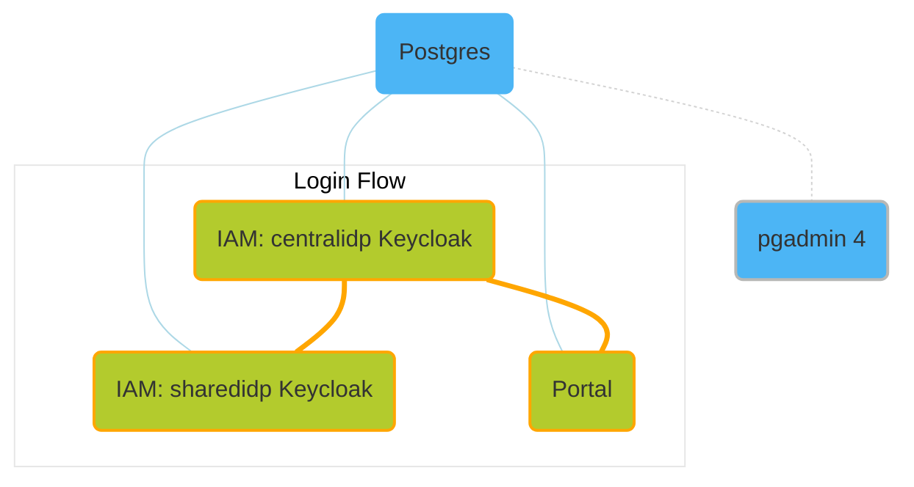

# Setup of CX Portal & IAM for local development

 

This umbrella chart installs the helm charts of the [CX Portal](https://github.com/eclipse-tractusx/portal-cd/blob/portal-2.0.0/charts/portal/README.md) and of the [CX IAM](https://github.com/eclipse-tractusx/portal-iam) Keycloak instances ([centralidp](https://github.com/eclipse-tractusx/portal-iam/blob/centralidp-3.0.0/charts/centralidp/README.md) and [sharedidp](https://github.com/eclipse-tractusx/portal-iam/blob/sharedidp-3.0.0/charts/sharedidp/README.md)).

It's intended for the local setup of the those components in order to aid the local development. To integrate your local development, adapt the address values in the Values file for [Portal Frontend](./values.yaml#L23) and/or [Portal Backend](./values.yaml#L27).

This chart also sets up an additional [postgresql](https://artifacthub.io/packages/helm/bitnami/postgresql) instance to support the Portal Backend development as well as a [pgadmin4](https://artifacthub.io/packages/helm/runix/pgadmin4) instance for easy access to the deployed Postgres databases which are only available from within the Kubernetes cluster.

For detailed information about the default configuration values, please have a look at the [Values table](#values) and/or [Values file](./values.yaml).

- [Usage](#usage)
- [Cluster setup](#cluster-setup)
  - [Linux and Mac](#cluster-setup-linux-and-mac)
  - [Cluster Setup Windows](#cluster-setup-windows)
    - [Minikube](#minikube)
    - [Docker Desktop integrated Kubernetes](#docker-desktop-integrated-kubernetes)
- [Network Setup](#network-setup)
  - [Minikube Addons](#minikube-addons)
  - [Docker Desktop integrated Kubernetes Ingress Controller](#docker-desktop-integrated-kubernetes-ingress-controller)
  - [Linux and Mac](#network-setup-on-linux-and-mac)
    - [Additional Network Setup for Mac](#additional-network-setup-for-mac)
  - [Windows/wsl2 with NTLM-proxy](#network-setup-on-windowswsl2-with-ntlm-proxy)
    - [px-proxy](#px-proxy)
    - [DNS-resolution in Windows](#dns-resolution-in-windows)
    - [DNS-resolution in wsl2](#dns-resolution-in-wsl2)
    - [Proxy-setup in wsl2](#proxy-setup-in-wsl2)
- [Install](#install)
  - [Use released chart](#use-released-chart)
  - [Use local repository](#use-local-repository)
- [Perform first login](#perform-first-login)
- [Database Access](#database-access)
- [Keycloak Admin Console](#keycloak-admin-console)
- [Uninstall](#uninstall)
- [Prepare self-signed TLS setup (Optional)](#prepare-self-signed-tls-setup-optional)

## Usage

The following steps describe how to setup the umbrella chart into the namespace 'umbrella' of your started [**Minikube**](https://minikube.sigs.k8s.io/docs/start) or *Docker Desktop* integrated Kubernetes cluster.

> **Note**
>
> In its current state of development, this chart as well as the following installation guide have been tested on Linux and Mac.
>
> **Linux** is the **preferred platform** to install this chart on as the network setup with Minikube is very straightforward on Linux.
>
> We are working on testing the chart's reliability on Windows as well and updating the installation guide accordingly.

> **Recommendations**
>
> Resources for Minikube
> | CPU(cores) | Memory(GB) |
> | :--------: | :--------: |
> |     4      |      6     |

> Use the dashboard provided by Minikube to get an overview about the deployed components:
>
> ```bash
> minikube dashboard
> ```

## Cluster Setup

### Cluster Setup Linux and Mac

```bash
minikube start --cpus=4 --memory 6gb
```

### Cluster Setup Windows

#### Minikube

For DNS resolution to work you need to either use `--driver=hyperv` option which requires administrator privileges:

```bash
minikube start --cpus=4 --memory 6gb --driver=hyperv
```

#### Docker Desktop integrated Kubernetes

*Docker Desktop* recommends the use of *wsl2* as backend:

- Settings > 'General'
  - enable 'Use the WSL 2 based engine'
  - enable 'Add the *.docker.internal names to the host's /etc/hosts file'
- Settings > 'Resources' > 'WSL integration'
  - enable 'Enable integration with my default WSL distro'

recommended wsl2-settings:

c:\Users\\<username\>\\.wslconfig (for details see <https://learn.microsoft.com/en-us/windows/wsl/wsl-config>)

```text
[wsl2]
memory=10GB  # Limits VM memory in WSL 2
processors=4  # Limits the number of virtual processors
swap=16GB  # Sets the swap size
[experimental]
autoMemoryReclaim = gradual
```

- Enable Kubernetes under Settings > Kubernetes > Enable Kubernetes

- Skip the minikube addons

## Network Setup

### Minikube Addons

In order to enable the local access via **ingress**, use the according addon for Minikube:

```bash
minikube addons enable ingress
```

Make sure that the **DNS** resolution for the hostnames is in place:

```bash
minikube addons enable ingress-dns
```

### Docker Desktop integrated Kubernetes Ingress Controller

- Install an NGINX Ingress Controller

```bash
helm upgrade --install ingress-nginx ingress-nginx --repo https://kubernetes.github.io/ingress-nginx --namespace ingress-nginx --create-namespace
```

### Network Setup on Linux and Mac

And execute installation step [3 Add the `minikube ip` as a DNS server](https://minikube.sigs.k8s.io/docs/handbook/addons/ingress-dns) for your OS:

```text
domain tx.test
nameserver 192.168.49.2
search_order 1
timeout 5
```

Replace 192.168.49.2 with your minikube ip.

To find out the IP address of your Minikube:

```bash
minikube ip
```

when facing DNS-issues while [performing the first login](#perform-first-login), add the following to your /etc/hosts file

```text
192.168.49.2    centralidp.tx.test
192.168.49.2    sharedidp.tx.test
192.168.49.2    portal.tx.test
192.168.49.2    portal-backend.tx.test
192.168.49.2    pgadmin4.tx.test
```

Replace 192.168.49.2 with your minikube ip

#### Additional Network Setup for Mac

Install and start [Docker Mac Net Connect](https://github.com/chipmk/docker-mac-net-connect#installation).

We also recommend to execute the usage example after install to check proper setup.

If you're having issues with getting 'Docker Mac Net Connect' to work, we recommend to check out this issue: [#21](https://github.com/chipmk/docker-mac-net-connect/issues/21).

The tool is necessary due to [#7332](https://github.com/kubernetes/minikube/issues/7332).

### Network Setup on Windows/wsl2 with NTLM-proxy

Configure wsl networking, assign additional fixed IP addresses to both wsl2 and windows, the wsl2-ip-address will then be used as cluster-ip-address. Do **not** use 127.0.0.1 as Cluster IP, as this causes issues when services try to access other services via the ingress from within the cluster.

In this tutorial we use:

- windows additional host ip 169.254.254.1
- wsl2 ip 169.254.254.2

#### px-proxy

Install px-proxy version v0.9.2 (or later) from <https://github.com/genotrance/px/releases> (minimum version is v0.9.0)

px.ini

```text
[proxy]
pac = http://proxypac.bmwgroup.net/proxy.pac
noproxy = 127.0.0.1,169.254.254.1,169.254.254.2,wsl,wsl.host,*.tx.test,localhost
```

In powershell set proxy environment variables:

```powershell
[Environment]::SetEnvironmentVariable('http_proxy','http://localhost:3128','User')
[Environment]::SetEnvironmentVariable('HTTP_PROXY','http://localhost:3128','User')
[Environment]::SetEnvironmentVariable('https_proxy','http://localhost:3128','User')
[Environment]::SetEnvironmentVariable('HTTPS_PROXY','http://localhost:3128','User')
[Environment]::SetEnvironmentVariable('no_proxy','localhost,127.0.0.1,wsl,wsl.host,169.254.254.1,169.254.254.2,*.tx.test,.tx.test,tx.test','User')
[Environment]::SetEnvironmentVariable('NO_PROXY','localhost,127.0.0.1,wsl,wsl.host,169.254.254.1,169.254.254.2,*.tx.test,.tx.test,tx.test','User')
```

In Firefox change the proxy to manual proxy configuration, <http://localhost:3128>

Chrome and Edge use the system proxy settings. Change those to 'manual', <http://localhost:3128> (both for http and https)
remark: on corporate managed windows the system proxy settings will eventually be overridden by the BMW system-management software and need to be re-configured whenever this happens.

#### DNS-resolution in Windows

c:\Windows\System32\drivers\etc\hosts

```text
169.254.254.2 wsl
169.254.254.2 centralidp.tx.test
169.254.254.2 sharedidp.tx.test
169.254.254.2 portal.tx.test
169.254.254.2 portal-backend.tx.test
169.254.254.2 pgadmin4.tx.test
```

#### DNS-resolution in wsl2

/etc/hosts

```text
169.254.254.1 wsl.host
169.254.254.2 centralidp.tx.test
169.254.254.2 sharedidp.tx.test
169.254.254.2 portal.tx.test
169.254.254.2 portal-backend.tx.test
169.254.254.2 pgadmin4.tx.test
```

#### Proxy-setup in wsl2

.profile

```bash
https_proxy=http://169.254.254.1:3128/
HTTPS_PROXY=http://169.254.254.1:3128/
http_proxy=http://169.254.254.1:3128/
HTTP_PROXY=http://169.254.254.1:3128/
no_proxy="localhost,127.0.0.1,wsl,wsl.host,169.254.254.1,169.254.254.2,docker.internal,tx.test"
NO_PROXY="localhost,127.0.0.1,wsl,wsl.host,169.254.254.1,169.254.254.2,docker.internal,tx.test"
```

## Install

### Use released chart

Install the chart with the release name 'local':

```bash
helm repo add tractusx-dev https://eclipse-tractusx.github.io/charts/dev
```

```bash
helm install local tractusx-dev/localdev-portal-iam --namespace umbrella --create-namespace
```

To set your own configuration and secret values, install the helm chart with your own values file:

```bash
helm install -f your-values.yaml local tractusx-dev/localdev-portal-iam --namespace umbrella --create-namespace
```

### Use local repository

Make sure to clone the [portal](https://github.com/eclipse-tractusx/portal) repository beforehand.

Then change to the chart directory:

```bash
cd charts/localdev/
```

Download the postgres dependency of the Portal helm chart:

```bash
helm dependency update ../portal
```

Download the chart dependencies of the LocalDev umbrella helm chart:

```bash
helm dependency update
```

Install the chart with the release name 'local':

```bash
helm install local . --namespace umbrella --create-namespace
```

To set your own configuration and secret values, install the helm chart with your own values file:

```bash
helm install local -f your-values.yaml . --namespace umbrella --create-namespace
```

> :warning: **Note**
>
> It is to be expected that some pods - which run as post-install hooks, like for instance the **portal-migrations job - will run into errors until another component**, like for instance a database, is ready to take connections.
> Those jobs will recreate pods until one run is successful.

In case that you have TLS enabled (see [Prepare self-signed TLS setup (Optional)](#1-prepare-self-signed-tls-setup-optional)), you can use the additional values-tls.yaml file - which is prepared for TLS usage - at install:

```bash
helm install local -f values-tls.yaml . --namespace umbrella --create-namespace
```

```bash
helm install local -f values-tls.yaml -f your-values.yaml . --namespace umbrella --create-namespace
```

## Perform first login

Then proceed with the login to the <http://portal.tx.test> to verify that everything is setup as expected.

Credentials to log into the initial example realm (CX-Operator):

```
cx-operator@tx.test
```

```
tractusx-umbr3lla!
```



The relevant hosts are the following:

- <http://centralidp.tx.test/auth/>
- <http://sharedidp.tx.test/auth/>
- <http://portal-backend.tx.test>
- <http://portal.tx.test>

In case that you have TLS enabled (see [Prepare self-signed TLS setup (Optional)](#1-prepare-self-signed-tls-setup-optional)), make sure to accept the risk of the self-signed certificates for all the hosts before performing the first login:

- <https://centralidp.tx.test/auth/>
- <https://sharedidp.tx.test/auth/>
- <https://portal-backend.tx.test>
- <https://portal.tx.test>

## Database Access

This chart also contains a pgadmin4 instance for easy access to the deployed Postgres databases which are only available from within the Kubernetes cluster.

pgadmin4 is by default enabled with in the predefined subsets for data exchange and portal.

Address: [pgadmin4.tx.test](http://pgadmin4.tx.test)

Credentials to login into pgadmin4:

```text
pgadmin4@txtest.org
```

```text
tractusxpgdamin4
```

**The database server connections need to be added manually to pgadmin4.**

Default username for all connections:

```text
postgres
```

Default port for all connections:

```text
5432
```

In the following some of the available connections:

- portal db

Host:

```text
local-portal-backend-postgresql
```

Password:

```text
dbpasswordportal
```

- centralidp db

Host:

```text
local-centralidp-postgresql
```

Password:

```text
dbpasswordcentralidp
```

- sharedidp db

Host:

```text
local-sharedidp-postgresql
```

Password:

```text
dbpasswordsharedidp
```

- additional portal db

Host:

```text
local-portal-postgresql
```

Password:

```text
dbpasswordadditional
```

## Keycloak Admin Console

Access to admin consoles:

- <http://centralidp.tx.test/auth/>
- <http://sharedidp.tx.test/auth/>

Default username for centralidp and sharedidp:

```text
admin
```

Password centralidp:

```text
adminconsolepwcentralidp
```

Password sharedidp:

```text
adminconsolepwsharedidp
```

## Uninstall

To teardown your setup, run:

```shell
helm delete local --namespace umbrella
```

> :warning:
>
> If persistance for one or more components is enabled, the persistent volume claims (PVCs) and connected persistent volumes (PVs) need to be removed manually even if you deleted the release from the cluster.
>

## Prepare self-signed TLS setup (Optional)

The components are prepared to be configured with TLS enabled (see "uncomment the following line for tls" comments in [values.yaml](./values.yaml)).

If you'd like to make use of that, make sure to to execute this step beforehand.

Install cert-manager chart in the same namespace where the localdev chart will be located.

```bash
helm repo add jetstack https://charts.jetstack.io
helm repo update
```

```bash
helm install \
  cert-manager jetstack/cert-manager \
  --namespace umbrella \
  --create-namespace \
  --version v1.13.0 \
  --set installCRDs=true
```

```bash
kubectl apply -f - <<EOF
apiVersion: cert-manager.io/v1
kind: ClusterIssuer
metadata:
  name: selfsigned-issuer
spec:
  selfSigned: {}
---
apiVersion: cert-manager.io/v1
kind: Certificate
metadata:
  name: my-selfsigned-ca
  namespace: umbrella
spec:
  isCA: true
  commonName: cx.local
  secretName: root-secret
  privateKey:
    algorithm: RSA
    size: 2048
  issuerRef:
    name: selfsigned-issuer
    kind: ClusterIssuer
    group: cert-manager.io
  subject:
    organizations:
      - CX
    countries:
      - DE
    provinces:
      - Some-State
---
apiVersion: cert-manager.io/v1
kind: ClusterIssuer
metadata:
  name: my-ca-issuer
spec:
  ca:
    secretName: root-secret
EOF
```

See [cert-manager self-signed](https://cert-manager.io/docs/configuration/selfsigned) for reference.

## Requirements

| Repository | Name | Version |
|------------|------|---------|
| file://../portal | portal | 2.6.0 |
| https://charts.bitnami.com/bitnami | postgresportal(postgresql) | 12.12.x |
| https://eclipse-tractusx.github.io/charts/dev | centralidp | 4.2.1 |
| https://eclipse-tractusx.github.io/charts/dev | sharedidp | 4.2.1 |
| https://helm.runix.net | pgadmin4 | 1.17.x |

## Values

| Key | Type | Default | Description |
|-----|------|---------|-------------|
| portal.enabled | bool | `true` |  |
| portal.portalAddress | string | `"http://portal.tx.test"` | Set your local frontend to integrate into local development. |
| portal.portalBackendAddress | string | `"http://portal-backend.tx.test"` | Set your local backend service to integrate into local development. Start port forwarding tunnel for database access, e.g.: 'kubectl port-forward service/local-portal-backend-postgresql 5432:5432 -n umbrella' |
| portal.centralidp.address | string | `"http://centralidp.tx.test"` |  |
| portal.sharedidpAddress | string | `"http://sharedidp.tx.test"` |  |
| portal.semanticsAddress | string | `"http://semantics.tx.test"` |  |
| portal.bpdm.poolAddress | string | `"http://business-partners.tx.test"` |  |
| portal.bpdm.portalGateAddress | string | `"http://business-partners.tx.test"` |  |
| portal.custodianAddress | string | `"http://managed-identity-wallets.tx.test"` |  |
| portal.sdfactoryAddress | string | `"http://sdfactory.tx.test"` |  |
| portal.clearinghouseAddress | string | `"http://validation.tx.test"` |  |
| portal.clearinghouseTokenAddress | string | `"http://keycloak.tx.test/realms/example/protocol/openid-connect/token"` |  |
| portal.clearinghouseConnectDisabled | bool | `false` |  |
| portal.issuerComponentAddress | string | `"http://ssi-credential-issuer.tx.test"` |  |
| portal.bpnDidResolver.managementApiAddress | string | `"http://bpn-did-resolution-service-bdrs-server:8081"` |  |
| portal.bpnDidResolver.directoryApiAddress | string | `"http://bpn-did-resolution-service.tx.test/api/directory"` |  |
| portal.dimWrapper.baseAddress | string | `"http://dim-wrapper.tx.test"` |  |
| portal.decentralIdentityManagementAuthAddress | string | `"http://dim.tx.test"` |  |
| portal.replicaCount | int | `1` |  |
| portal.readinessProbes.initialDelaySeconds | int | `200` |  |
| portal.frontend.portal.requireHttpsUrlPattern | bool | `false` |  |
| portal.frontend.ingress.enabled | bool | `true` |  |
| portal.frontend.ingress.className | string | `"nginx"` |  |
| portal.frontend.ingress.annotations."nginx.ingress.kubernetes.io/rewrite-target" | string | `"/$1"` |  |
| portal.frontend.ingress.annotations."nginx.ingress.kubernetes.io/use-regex" | string | `"true"` |  |
| portal.frontend.ingress.annotations."nginx.ingress.kubernetes.io/enable-cors" | string | `"true"` |  |
| portal.frontend.ingress.annotations."nginx.ingress.kubernetes.io/cors-allow-origin" | string | `"http://*.tx.test"` |  |
| portal.frontend.ingress.hosts[0].host | string | `"portal.tx.test"` |  |
| portal.frontend.ingress.hosts[0].paths[0].path | string | `"/(.*)"` |  |
| portal.frontend.ingress.hosts[0].paths[0].pathType | string | `"ImplementationSpecific"` |  |
| portal.frontend.ingress.hosts[0].paths[0].backend.service | string | `"portal"` |  |
| portal.frontend.ingress.hosts[0].paths[0].backend.port | int | `8080` |  |
| portal.frontend.ingress.hosts[0].paths[1].path | string | `"/registration/(.*)"` |  |
| portal.frontend.ingress.hosts[0].paths[1].pathType | string | `"ImplementationSpecific"` |  |
| portal.frontend.ingress.hosts[0].paths[1].backend.service | string | `"registration"` |  |
| portal.frontend.ingress.hosts[0].paths[1].backend.port | int | `8080` |  |
| portal.frontend.ingress.hosts[0].paths[2].path | string | `"/((assets|documentation)/.*)"` |  |
| portal.frontend.ingress.hosts[0].paths[2].pathType | string | `"ImplementationSpecific"` |  |
| portal.frontend.ingress.hosts[0].paths[2].backend.service | string | `"assets"` |  |
| portal.frontend.ingress.hosts[0].paths[2].backend.port | int | `8080` |  |
| portal.backend.dotnetEnvironment | string | `"Development"` |  |
| portal.backend.useDimWallet | bool | `true` |  |
| portal.backend.keycloak.central.clientId | string | `"sa-cl1-reg-2"` |  |
| portal.backend.keycloak.central.clientSecret | string | `"changeme"` |  |
| portal.backend.keycloak.central.jwtBearerOptions.requireHttpsMetadata | string | `"false"` |  |
| portal.backend.keycloak.shared.clientId | string | `"sa-cl1-reg-1"` |  |
| portal.backend.keycloak.shared.clientSecret | string | `"changeme"` |  |
| portal.backend.registration.logging.default | string | `"Debug"` |  |
| portal.backend.registration.logging.bpdmLibrary | string | `"Debug"` |  |
| portal.backend.registration.logging.registrationService | string | `"Debug"` |  |
| portal.backend.registration.swaggerEnabled | bool | `true` |  |
| portal.backend.administration.logging.default | string | `"Debug"` |  |
| portal.backend.administration.logging.businessLogic | string | `"Debug"` |  |
| portal.backend.administration.logging.sdfactoryLibrary | string | `"Debug"` |  |
| portal.backend.administration.logging.bpdmLibrary | string | `"Debug"` |  |
| portal.backend.administration.logging.custodianLibrary | string | `"Debug"` |  |
| portal.backend.administration.serviceAccount.encryptionConfigs.index0.encryptionKey | string | `"deb8261ec7b89c344f1c5ef5a11606e305f14e0d231b1357d90ad0180c5081d3"` |  |
| portal.backend.administration.issuerdid | string | `"did:web:tx.test:test123"` |  |
| portal.backend.administration.swaggerEnabled | bool | `true` |  |
| portal.backend.appmarketplace.logging.default | string | `"Debug"` |  |
| portal.backend.appmarketplace.logging.offersLibrary | string | `"Debug"` |  |
| portal.backend.appmarketplace.swaggerEnabled | bool | `true` |  |
| portal.backend.appmarketplace.resources.limits.memory | string | `"600M"` |  |
| portal.backend.services.logging.default | string | `"Debug"` |  |
| portal.backend.services.logging.offersLibrary | string | `"Debug"` |  |
| portal.backend.services.swaggerEnabled | bool | `true` |  |
| portal.backend.notification.logging.default | string | `"Debug"` |  |
| portal.backend.notification.swaggerEnabled | bool | `true` |  |
| portal.backend.processesworker.logging.default | string | `"Debug"` |  |
| portal.backend.processesworker.logging.processesLibrary | string | `"Debug"` |  |
| portal.backend.processesworker.logging.bpdmLibrary | string | `"Debug"` |  |
| portal.backend.processesworker.logging.clearinghouseLibrary | string | `"Debug"` |  |
| portal.backend.processesworker.logging.custodianLibrary | string | `"Debug"` |  |
| portal.backend.processesworker.logging.sdfactoryLibrary | string | `"Debug"` |  |
| portal.backend.processesworker.logging.offerProvider | string | `"Debug"` |  |
| portal.backend.processesworker.bpdm.clientId | string | `"sa-cl7-cx-5"` |  |
| portal.backend.processesworker.bpdm.clientSecret | string | `"changeme"` |  |
| portal.backend.processesworker.custodian | object | `{"clientId":"sa-cl5-custodian-2","clientSecret":"changeme"}` | no configuration for clearinghouse because it's an external component clientId and clientSecret aren't in the centralidp Keycloak clearinghouse:   clientId: "clearinghouse-client-id"   clientSecret: "" |
| portal.backend.processesworker.sdfactory.clientId | string | `"sa-cl8-cx-1"` |  |
| portal.backend.processesworker.sdfactory.clientSecret | string | `"changeme"` |  |
| portal.backend.processesworker.offerprovider.clientId | string | `"sa-cl2-03"` |  |
| portal.backend.processesworker.offerprovider.clientSecret | string | `"changeme"` |  |
| portal.backend.processesworker.dim.clientId | string | `"dim-client-id"` |  |
| portal.backend.processesworker.dim.clientSecret | string | `""` |  |
| portal.backend.processesworker.dim.universalResolverAddress | string | `"https://dev.uniresolver.io/"` |  |
| portal.backend.processesworker.dim.encryptionConfigs.index0.encryptionKey | string | `"6cbaf47ee30c778088e6faa44e2f0eed98beda86db06c7d2e37e32ab78e14b33"` |  |
| portal.backend.processesworker.issuerComponent.clientId | string | `"sa-cl2-04"` |  |
| portal.backend.processesworker.issuerComponent.clientSecret | string | `"changeme"` |  |
| portal.backend.processesworker.bpnDidResolver.apiKey | string | `""` | ApiKey for management endpoint of the bpnDidResolver. Secret-key 'bpndidresolver-api-key'. |
| portal.backend.processesworker.onboardingServiceProvider.encryptionConfigs.index0.cipherMode | string | `"CBC"` |  |
| portal.backend.processesworker.onboardingServiceProvider.encryptionConfigs.index0.paddingMode | string | `"PKCS7"` |  |
| portal.backend.processesworker.onboardingServiceProvider.encryptionConfigs.index0.encryptionKey | string | `"f7bc3d99f1ace73e7a75b794affbbc26206ab29909821a102aaccb2e95e45f7c"` |  |
| portal.backend.processesworker.onboardingServiceProvider.encryptionConfigs.index1.encryptionKey | string | `"8027152fe7a869c88acc86981760acd70ff1d660c2bd129eece94edef933caf7"` |  |
| portal.backend.processesworker.invitation.encryptionConfigs.index0.encryptionKey | string | `"d84fea29d6eac0fa51e36682b164e7d61693cd4202ed04306d2d9c5d46655e2c"` |  |
| portal.backend.processesworker.mailing.encryptionConfigs.index0.encryptionKey | string | `"d2e27d71b018cb36029184852f1baa3e26891be94718f77de4c7cc6c882fe317"` |  |
| portal.backend.mailing.host | string | `"smtp.tx.test"` |  |
| portal.backend.mailing.port | string | `"587"` |  |
| portal.backend.mailing.user | string | `"smtp-user"` |  |
| portal.backend.mailing.senderEmail | string | `"smtp@tx.test"` |  |
| portal.backend.mailing.password | string | `""` |  |
| portal.backend.portalmigrations.logging.default | string | `"Debug"` |  |
| portal.backend.portalmigrations.resources.limits.cpu | string | `"200m"` |  |
| portal.backend.portalmigrations.seeding.seedTestData.useDefault | bool | `true` |  |
| portal.backend.provisioningmigrations.logging.default | string | `"Debug"` |  |
| portal.backend.provisioningmigrations.resources.limits.cpu | string | `"150m"` |  |
| portal.backend.provisioning.sharedRealm.smtpServer.host | string | `"smtp.tx.test"` |  |
| portal.backend.provisioning.sharedRealm.smtpServer.port | string | `"587"` |  |
| portal.backend.provisioning.sharedRealm.smtpServer.user | string | `"smtp-user"` |  |
| portal.backend.provisioning.sharedRealm.smtpServer.password | string | `""` |  |
| portal.backend.provisioning.sharedRealm.smtpServer.from | string | `"smtp@tx.test"` |  |
| portal.backend.provisioning.sharedRealm.smtpServer.replyTo | string | `"smtp@tx.test"` |  |
| portal.backend.ingress | object | `{"annotations":{"nginx.ingress.kubernetes.io/cors-allow-origin":"http://localhost:3000, http://*.tx.test","nginx.ingress.kubernetes.io/enable-cors":"true","nginx.ingress.kubernetes.io/proxy-body-size":"8m","nginx.ingress.kubernetes.io/use-regex":"true"},"className":"nginx","enabled":true,"hosts":[{"host":"portal-backend.tx.test","paths":[{"backend":{"port":8080,"service":"registration-service"},"path":"/api/registration","pathType":"Prefix"},{"backend":{"port":8080,"service":"administration-service"},"path":"/api/administration","pathType":"Prefix"},{"backend":{"port":8080,"service":"notification-service"},"path":"/api/notification","pathType":"Prefix"},{"backend":{"port":8080,"service":"provisioning-service"},"path":"/api/provisioning","pathType":"Prefix"},{"backend":{"port":8080,"service":"marketplace-app-service"},"path":"/api/apps","pathType":"Prefix"},{"backend":{"port":8080,"service":"services-service"},"path":"/api/services","pathType":"Prefix"}]}],"name":"portal-backend"}` | docs: http://portal-backend.tx.test/api/administration/swagger/index.html http://portal-backend.tx.test/api/registration/swagger/index.html http://portal-backend.tx.test/api/apps/swagger/index.html http://portal-backend.tx.test/api/services/swagger/index.html http://portal-backend.tx.test/api/notification/swagger/index.html |
| portal.postgresql.nameOverride | string | `"portal-backend-postgresql"` |  |
| portal.postgresql.image.registry | string | `"docker.io"` |  |
| portal.postgresql.image.repository | string | `"bitnamilegacy/postgresql"` |  |
| portal.postgresql.image.tag | string | `"15-debian-11"` |  |
| portal.postgresql.architecture | string | `"standalone"` |  |
| portal.postgresql.auth.password | string | `"dbpasswordportal"` |  |
| portal.postgresql.auth.portalPassword | string | `"dbpasswordportal"` |  |
| portal.postgresql.auth.provisioningPassword | string | `"dbpasswordportal"` |  |
| centralidp.enabled | bool | `true` |  |
| centralidp.keycloak.nameOverride | string | `"centralidp"` |  |
| centralidp.keycloak.replicaCount | int | `1` |  |
| centralidp.keycloak.auth.adminPassword | string | `"adminconsolepwcentralidp"` |  |
| centralidp.keycloak.postgresql.nameOverride | string | `"centralidp-postgresql"` |  |
| centralidp.keycloak.postgresql.auth.password | string | `"dbpasswordcentralidp"` |  |
| centralidp.keycloak.postgresql.auth.postgresPassword | string | `"dbpasswordcentralidp"` |  |
| centralidp.keycloak.ingress.enabled | bool | `true` |  |
| centralidp.keycloak.ingress.ingressClassName | string | `"nginx"` |  |
| centralidp.keycloak.ingress.hostname | string | `"centralidp.tx.test"` |  |
| centralidp.keycloak.ingress.annotations."nginx.ingress.kubernetes.io/cors-allow-credentials" | string | `"true"` |  |
| centralidp.keycloak.ingress.annotations."nginx.ingress.kubernetes.io/cors-allow-methods" | string | `"PUT, GET, POST, OPTIONS"` |  |
| centralidp.keycloak.ingress.annotations."nginx.ingress.kubernetes.io/cors-allow-origin" | string | `"http://centralidp.tx.test"` |  |
| centralidp.keycloak.ingress.annotations."nginx.ingress.kubernetes.io/enable-cors" | string | `"true"` |  |
| centralidp.keycloak.ingress.annotations."nginx.ingress.kubernetes.io/proxy-buffer-size" | string | `"128k"` |  |
| centralidp.keycloak.ingress.annotations."nginx.ingress.kubernetes.io/proxy-buffering" | string | `"on"` |  |
| centralidp.keycloak.ingress.annotations."nginx.ingress.kubernetes.io/proxy-buffers-number" | string | `"20"` |  |
| centralidp.keycloak.ingress.annotations."nginx.ingress.kubernetes.io/use-regex" | string | `"true"` |  |
| centralidp.keycloak.ingress.tls | bool | `false` |  |
| centralidp.realmSeeding.sslRequired | string | `"none"` |  |
| centralidp.realmSeeding.clients.registration.redirects[0] | string | `"http://portal.tx.test/*"` |  |
| centralidp.realmSeeding.clients.registration.redirects[1] | string | `"http://localhost:3000/*"` |  |
| centralidp.realmSeeding.clients.portal.rootUrl | string | `"http://portal.tx.test/home"` |  |
| centralidp.realmSeeding.clients.portal.redirects[0] | string | `"http://portal.tx.test/*"` |  |
| centralidp.realmSeeding.clients.portal.redirects[1] | string | `"http://localhost:3000/*"` |  |
| centralidp.realmSeeding.clients.semantics.redirects[0] | string | `"http://portal.tx.test/*"` |  |
| centralidp.realmSeeding.clients.miw.clientSecret | string | `"changeme"` |  |
| centralidp.realmSeeding.clients.miw.redirects[0] | string | `"http://managed-identity-wallets.tx.test/*"` |  |
| centralidp.realmSeeding.clients.bpdm.clientSecret | string | `"changeme"` |  |
| centralidp.realmSeeding.clients.bpdm.redirects[0] | string | `"http://partners-pool.tx.test/*"` |  |
| centralidp.realmSeeding.clients.bpdmGate.clientSecret | string | `"changeme"` |  |
| centralidp.realmSeeding.clients.bpdmGate.redirects[0] | string | `"http://partners-gate.tx.test/*"` |  |
| centralidp.realmSeeding.clients.bpdmOrchestrator.clientSecret | string | `"changeme"` |  |
| centralidp.realmSeeding.serviceAccounts.clientSecrets[0].clientId | string | `"sa-cl1-reg-2"` |  |
| centralidp.realmSeeding.serviceAccounts.clientSecrets[0].clientSecret | string | `"changeme"` |  |
| centralidp.realmSeeding.serviceAccounts.clientSecrets[1].clientId | string | `"sa-cl2-01"` |  |
| centralidp.realmSeeding.serviceAccounts.clientSecrets[1].clientSecret | string | `"changeme"` |  |
| centralidp.realmSeeding.serviceAccounts.clientSecrets[2].clientId | string | `"sa-cl2-02"` |  |
| centralidp.realmSeeding.serviceAccounts.clientSecrets[2].clientSecret | string | `"changeme"` |  |
| centralidp.realmSeeding.serviceAccounts.clientSecrets[3].clientId | string | `"sa-cl2-03"` |  |
| centralidp.realmSeeding.serviceAccounts.clientSecrets[3].clientSecret | string | `"changeme"` |  |
| centralidp.realmSeeding.serviceAccounts.clientSecrets[4].clientId | string | `"sa-cl2-04"` |  |
| centralidp.realmSeeding.serviceAccounts.clientSecrets[4].clientSecret | string | `"changeme"` |  |
| centralidp.realmSeeding.serviceAccounts.clientSecrets[5].clientId | string | `"sa-cl2-05"` |  |
| centralidp.realmSeeding.serviceAccounts.clientSecrets[5].clientSecret | string | `"changeme"` |  |
| centralidp.realmSeeding.serviceAccounts.clientSecrets[6].clientId | string | `"sa-cl2-06"` |  |
| centralidp.realmSeeding.serviceAccounts.clientSecrets[6].clientSecret | string | `"changeme"` |  |
| centralidp.realmSeeding.serviceAccounts.clientSecrets[7].clientId | string | `"sa-cl3-cx-1"` |  |
| centralidp.realmSeeding.serviceAccounts.clientSecrets[7].clientSecret | string | `"changeme"` |  |
| centralidp.realmSeeding.serviceAccounts.clientSecrets[8].clientId | string | `"sa-cl5-custodian-2"` |  |
| centralidp.realmSeeding.serviceAccounts.clientSecrets[8].clientSecret | string | `"changeme"` |  |
| centralidp.realmSeeding.serviceAccounts.clientSecrets[9].clientId | string | `"sa-cl7-cx-1"` |  |
| centralidp.realmSeeding.serviceAccounts.clientSecrets[9].clientSecret | string | `"changeme"` |  |
| centralidp.realmSeeding.serviceAccounts.clientSecrets[10].clientId | string | `"sa-cl7-cx-5"` |  |
| centralidp.realmSeeding.serviceAccounts.clientSecrets[10].clientSecret | string | `"changeme"` |  |
| centralidp.realmSeeding.serviceAccounts.clientSecrets[11].clientId | string | `"sa-cl7-cx-7"` |  |
| centralidp.realmSeeding.serviceAccounts.clientSecrets[11].clientSecret | string | `"changeme"` |  |
| centralidp.realmSeeding.serviceAccounts.clientSecrets[12].clientId | string | `"sa-cl8-cx-1"` |  |
| centralidp.realmSeeding.serviceAccounts.clientSecrets[12].clientSecret | string | `"changeme"` |  |
| centralidp.realmSeeding.serviceAccounts.clientSecrets[13].clientId | string | `"sa-cl21-01"` |  |
| centralidp.realmSeeding.serviceAccounts.clientSecrets[13].clientSecret | string | `"changeme"` |  |
| centralidp.realmSeeding.serviceAccounts.clientSecrets[14].clientId | string | `"sa-cl22-01"` |  |
| centralidp.realmSeeding.serviceAccounts.clientSecrets[14].clientSecret | string | `"changeme"` |  |
| centralidp.realmSeeding.serviceAccounts.clientSecrets[15].clientId | string | `"sa-cl24-01"` |  |
| centralidp.realmSeeding.serviceAccounts.clientSecrets[15].clientSecret | string | `"changeme"` |  |
| centralidp.realmSeeding.serviceAccounts.clientSecrets[16].clientId | string | `"sa-cl25-cx-1"` |  |
| centralidp.realmSeeding.serviceAccounts.clientSecrets[16].clientSecret | string | `"changeme"` |  |
| centralidp.realmSeeding.serviceAccounts.clientSecrets[17].clientId | string | `"sa-cl25-cx-2"` |  |
| centralidp.realmSeeding.serviceAccounts.clientSecrets[17].clientSecret | string | `"changeme"` |  |
| centralidp.realmSeeding.serviceAccounts.clientSecrets[18].clientId | string | `"sa-cl25-cx-3"` |  |
| centralidp.realmSeeding.serviceAccounts.clientSecrets[18].clientSecret | string | `"changeme"` |  |
| centralidp.realmSeeding.bpn | string | `"BPNL00000003CRHK"` |  |
| centralidp.realmSeeding.sharedidp | string | `"http://sharedidp.tx.test"` |  |
| sharedidp.enabled | bool | `true` |  |
| sharedidp.keycloak.nameOverride | string | `"sharedidp"` |  |
| sharedidp.keycloak.replicaCount | int | `1` |  |
| sharedidp.keycloak.auth.adminPassword | string | `"adminconsolepwsharedidp"` |  |
| sharedidp.keycloak.postgresql.nameOverride | string | `"sharedidp-postgresql"` |  |
| sharedidp.keycloak.postgresql.auth.password | string | `"dbpasswordsharedidp"` |  |
| sharedidp.keycloak.postgresql.auth.postgresPassword | string | `"dbpasswordsharedidp"` |  |
| sharedidp.keycloak.ingress.enabled | bool | `true` |  |
| sharedidp.keycloak.ingress.ingressClassName | string | `"nginx"` |  |
| sharedidp.keycloak.ingress.hostname | string | `"sharedidp.tx.test"` |  |
| sharedidp.keycloak.ingress.annotations."nginx.ingress.kubernetes.io/cors-allow-credentials" | string | `"true"` |  |
| sharedidp.keycloak.ingress.annotations."nginx.ingress.kubernetes.io/cors-allow-methods" | string | `"PUT, GET, POST, OPTIONS"` |  |
| sharedidp.keycloak.ingress.annotations."nginx.ingress.kubernetes.io/cors-allow-origin" | string | `"http://sharedidp.tx.test"` |  |
| sharedidp.keycloak.ingress.annotations."nginx.ingress.kubernetes.io/enable-cors" | string | `"true"` |  |
| sharedidp.keycloak.ingress.annotations."nginx.ingress.kubernetes.io/proxy-buffer-size" | string | `"128k"` |  |
| sharedidp.keycloak.ingress.annotations."nginx.ingress.kubernetes.io/proxy-buffering" | string | `"on"` |  |
| sharedidp.keycloak.ingress.annotations."nginx.ingress.kubernetes.io/proxy-buffers-number" | string | `"20"` |  |
| sharedidp.keycloak.ingress.annotations."nginx.ingress.kubernetes.io/use-regex" | string | `"true"` |  |
| sharedidp.keycloak.ingress.tls | bool | `false` |  |
| sharedidp.realmSeeding.realms.cxOperator.sslRequired | string | `"none"` |  |
| sharedidp.realmSeeding.realms.cxOperator.centralidp | string | `"http://centralidp.tx.test"` |  |
| sharedidp.realmSeeding.realms.cxOperator.initialUser.username | string | `"cx-operator@tx.test"` |  |
| sharedidp.realmSeeding.realms.cxOperator.initialUser.password | string | `"tractusx-umbr3lla!"` |  |
| sharedidp.realmSeeding.realms.cxOperator.mailing.host | string | `"smtp.tx.test"` |  |
| sharedidp.realmSeeding.realms.cxOperator.mailing.port | string | `"587"` |  |
| sharedidp.realmSeeding.realms.cxOperator.mailing.username | string | `"smtp-user"` |  |
| sharedidp.realmSeeding.realms.cxOperator.mailing.password | string | `""` |  |
| sharedidp.realmSeeding.realms.cxOperator.mailing.from | string | `"smtp@tx.test"` |  |
| sharedidp.realmSeeding.realms.cxOperator.mailing.replyTo | string | `"smtp@tx.test"` |  |
| sharedidp.realmSeeding.realms.master.serviceAccounts.provisioning.clientSecret | string | `"changeme"` |  |
| sharedidp.realmSeeding.realms.master.serviceAccounts.saCxOperator.clientSecret | string | `"changeme"` |  |
| postgresportal.enabled | bool | `true` | Additional PostgreSQL for backend development; start port forwarding tunnel for database access, e.g.: 'kubectl port-forward service/local-portal-postgresql 5432:5432 -n umbrella' |
| postgresportal.nameOverride | string | `"portal-postgresql"` |  |
| postgresportal.auth.database | string | `"postgres"` |  |
| postgresportal.auth.port | int | `5432` |  |
| postgresportal.auth.existingSecret | string | `"secret-postgres-init-localdev"` |  |
| postgresportal.auth.portalUser | string | `"portal"` |  |
| postgresportal.auth.provisioningUser | string | `"provisioning"` |  |
| postgresportal.auth.password | string | `"dbpasswordadditional"` |  |
| postgresportal.auth.portalPassword | string | `"dbpasswordadditional"` |  |
| postgresportal.auth.provisioningPassword | string | `"dbpasswordadditional"` |  |
| postgresportal.architecture | string | `"standalone"` |  |
| postgresportal.audit.pgAuditLog | string | `"write, ddl"` |  |
| postgresportal.audit.logLinePrefix | string | `"%m %u %d "` |  |
| postgresportal.primary.initdb.scriptsConfigMap | string | `"configmap-postgres-init-localdev"` |  |
| postgresportal.primary.extraEnvVars[0].name | string | `"PORTAL_PASSWORD"` |  |
| postgresportal.primary.extraEnvVars[0].valueFrom.secretKeyRef.name | string | `"{{ .Values.auth.existingSecret }}"` |  |
| postgresportal.primary.extraEnvVars[0].valueFrom.secretKeyRef.key | string | `"portal-password"` |  |
| postgresportal.primary.extraEnvVars[1].name | string | `"PROVISIONING_PASSWORD"` |  |
| postgresportal.primary.extraEnvVars[1].valueFrom.secretKeyRef.name | string | `"{{ .Values.auth.existingSecret }}"` |  |
| postgresportal.primary.extraEnvVars[1].valueFrom.secretKeyRef.key | string | `"provisioning-password"` |  |
| pgadmin4.enabled | bool | `true` |  |
| pgadmin4.env.email | string | `"pgadmin4@txtest.org"` |  |
| pgadmin4.env.password | string | `"tractusxpgdamin4"` |  |
| pgadmin4.ingress.enabled | bool | `true` |  |
| pgadmin4.ingress.ingressClassName | string | `"nginx"` |  |
| pgadmin4.ingress.hosts[0].host | string | `"pgadmin4.tx.test"` |  |
| pgadmin4.ingress.hosts[0].paths[0].path | string | `"/"` |  |
| pgadmin4.ingress.hosts[0].paths[0].pathType | string | `"Prefix"` |  |

Autogenerated with [helm docs](https://github.com/norwoodj/helm-docs)
